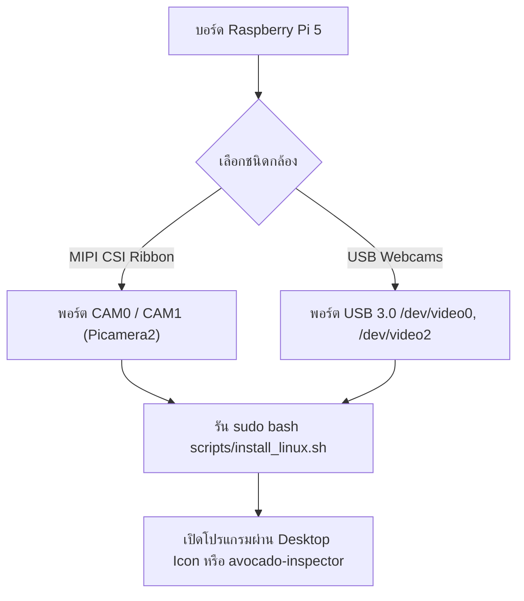

# 🥑 Avocado Ripeness & Variety Detection System
### ระบบตรวจวัดระดับความสุกและจำแนกสายพันธุ์อะโวคาโด (On-Demand Dual-Camera AI System)

[](https://github.com/Kuma2438/Ripeness-Level-Detection-of-Avocado-Fruit-Using-Image-Processing-Technology/releases/tag/v1.1.0-refac5-10-69)
[](https://www.raspberrypi.com/products/raspberry-pi-5/)
[](#-คู่มือการติดตั้งบน-windows-windows-installation-guide)
[-red.svg)](https://pytorch.org/)
[](#-ความปลอดภัยและประสิทธิภาพ-security--speed-optimizations)
[](LICENSE)

ระบบ AI ตรวจวัดระดับความสุกและจำแนกสายพันธุ์ผลอะโวคาโดแบบ **On-Demand (Standby Live Preview + ถ่ายภาพเพื่อวิเคราะห์เมื่อพร้อม)** รองรับกล้อง **Dual USB Webcams** และกล้องคู่ **Dual MIPI CSI บน Raspberry Pi 5** 

รองรับการติดตั้งและใช้งาน 2 แพลตฟอร์มหลัก:
1. **Windows (Standalone 100%)**: ตัวติดตั้ง **`AvocadoInspector-Setup.exe`** และแบบ Portable ที่ฝัง Python Runtime ในตัว **ใช้งานได้ทันทีโดยไม่ต้องลง Python หรือไลบรารีใดๆ ในเครื่อง**
2. **Linux & Raspberry Pi 5**: สคริปต์ติดตั้งระบบอัตโนมัติ 1-Click พร้อมรองรับโหมด **GUI Touchscreen Kiosk**, **Headless CLI**, และ **JSON Stream สำหรับส่งข้อมูลเข้า PLC / แขนกลคัดแยก**

---

## 🌟 ฟีเจอร์เด่น (Key Features)

- **On-Demand Inspection (Zero-Load Standby)**:
  - **โหมด Standby**: กล้องแสดงภาพสด 30–60 FPS พร้อมกรอบเล็งตำแหน่งผล โดยไม่มีการรันโมเดล AI ตลอดเวลา (ประหยัดพลังงาน 0% AI Load)
  - **กดตรวจวัด**: กดปุ่ม **"📸 ตรวจวัดความสุก"** หรือกด **`Spacebar` / `Enter`** ระบบจะ Freeze ภาพจากกล้อง 2 ฝั่ง รันโมเดล AI และแสดงระดับความสุกทันที
  - **ตรวจผลถัดไป**: กด **`Spacebar` / `Enter`** อีกครั้งเพื่อรีเซ็ตกลับสู่โหมด Standby รอผลถัดไป
- **Asynchronous Double-Buffered Camera Pipeline**: แยก Thread ดึงภาพจากกล้องทั้ง 2 ตัวออกจาก GUI Loop ทำให้ภาพพรีวิวไหลลื่น 60 FPS ไม่กระตุก
- **Lightweight Pure PyTorch CNN**: โมเดลโครงข่ายประสาทเทียมขนาดเบา ประมวลผลบน CPU ได้เร็วพิเศษ (<12ms) พร้อมฝังโมเดลความสุกและสายพันธุ์ไว้ในตัว
- **Edge Acceleration Support**: รองรับการ Export โมเดลเป็น **TorchScript** และ **ONNX**
- **Ripeness Speedometer Gauge**: เกจวัดความเร็วเข็มไมล์แสดงระดับความสุกแบบไดนามิก 0–100% (*ดิบ / กึ่งสุก / สุก*)
- **Variety Trainer Studio**: หน้าต่าง GUI สำหรับสร้าง Label สายพันธุ์ใหม่ ถ่ายภาพสะสมตัวอย่าง และเทรนโมเดลใหม่ได้บนตัวเครื่องทันที

---

## 🛡️ ความปลอดภัยและประสิทธิภาพ (Security & Speed Optimizations)

- 🔒 **Safe Model Deserialization**: บังคับใช้ `weights_only=True` ใน `torch.load()` ป้องกันช่องโหว่ Arbitrary Code Execution จากไฟล์ Checkpoint
- 🔒 **Air-Gap & DLP Hardened**: กฎ `.gitignore` เข้มงวด ป้องกันการรั่วไหลของ Secrets, `.env*`, และ Credentials
- ⚡ **Zero-Allocation Preprocessing**: คำนวณค่า Mean/Std ผ่าน Constant Tensors ลดภาระ Memory Allocation ในทุกเฟรม
- ⚡ **`@torch.inference_mode()`**: ข้ามการสร้าง Autograd Tracking ทั้งหมด เพิ่มความเร็ว Inference ขึ้น 20-30%
- ⚡ **Otsu Adaptive Segmentation**: ใช้อัลกอริทึม Gaussian Blur + Otsu Thresholding ตัดขอบผลอะโวคาโดได้แม่นยำทุกสภาพแสง

---

## 💻 คู่มือการติดตั้งบน Windows (Windows Installation Guide)

### วิธีที่ 1: ติดตั้งผ่านตัวติดตั้ง Setup Wizard (.exe) — ⭐ แนะนำที่สุด
> **ไม่ต้องติดตั้ง Python ในเครื่อง** — ตัวติดตั้งได้ฝัง Python, PyTorch, OpenCV, GUI และโมเดลทั้งหมดไว้ในตัวแล้ว

1. ดาวน์โหลดไฟล์ [**`AvocadoInspector-Setup.exe`**](https://github.com/Kuma2438/Ripeness-Level-Detection-of-Avocado-Fruit-Using-Image-Processing-Technology/releases/tag/v1.1.0-refac5-10-69) จากหน้า Releases (หรือในโฟลเดอร์ `package/`)
2. ดับเบิ้ลคลิกไฟล์ **`AvocadoInspector-Setup.exe`** เพื่อเริ่มติดตั้ง
3. เลือกโฟลเดอร์ปลายทาง (ค่าเริ่มต้น: `%LOCALAPPDATA%\AvocadoInspector`)
4. ติ๊กเลือก **"Create a Desktop shortcut"** แล้วกดปุ่ม **Install**
5. ดับเบิ้ลคลิกไอคอน **Avocado Ripeness Inspector** บนหน้าจอ Desktop หรือ Start Menu เพื่อเปิดใช้งานได้ทันที

---

### วิธีที่ 2: รันแบบ Portable ZIP (ไม่ต้องติดตั้ง / เสียบ Flash Drive ใช้งานได้เลย)
1. ดาวน์โหลดไฟล์ [**`avocado-inspector-windows-x64.zip`**](https://github.com/Kuma2438/Ripeness-Level-Detection-of-Avocado-Fruit-Using-Image-Processing-Technology/releases/tag/v1.1.0-refac5-10-69)
2. แตกไฟล์ ZIP ออกมาไว้ในโฟลเดอร์ที่ต้องการ
3. ดับเบิ้ลคลิกไฟล์ **`avocado-inspector.exe`** เพื่อเปิดโปรแกรมทันที

---

### วิธีที่ 3: รันจาก Source Code (สำหรับนักพัฒนา / Developer Mode)
หากต้องการแก้ไขโค้ดหรือเทรนโมเดลเพิ่มเติม:
1. Clone โปรเจกต์:
   ```powershell
   git clone -b refac5/10/69 https://github.com/Kuma2438/Ripeness-Level-Detection-of-Avocado-Fruit-Using-Image-Processing-Technology.git
   cd Ripeness-Level-Detection-of-Avocado-Fruit-Using-Image-Processing-Technology
   ```
2. ดับเบิ้ลคลิกไฟล์ **`run.bat`** (มีระบบ Auto-Bootstrap ตรวจหา Python, ติดตั้งผ่าน winget และสร้าง virtual environment ให้อัตโนมัติ)
3. เลือกเมนู **`[1]`** เพื่อเปิดใช้งานโปรแกรม

---

## 🍓 คู่มือการติดตั้งบน Linux / Raspberry Pi 5 (Linux & Pi 5 Guide)

รองรับ **Raspberry Pi 5 (4GB / 8GB)** บน **Raspberry Pi OS 64-bit (Debian 12 Bookworm)** และ Ubuntu Linux 22.04 / 24.04



### ขั้นตอนที่ 1: การเชื่อมต่อกล้อง (Camera Hardware Setup)
- **แบบที่ 1: กล้องคู่ MIPI CSI (OV5647 5MP / IMX series)**
  - เสียบสายแพกล้องตัวที่ 1 เข้าพอร์ต `CAM0` บนบอร์ด Raspberry Pi 5
  - เสียบสายแพกล้องตัวที่ 2 เข้าพอร์ต `CAM1` บนบอร์ด Raspberry Pi 5
  - ระบบจะตรวจจับและเปิดใช้งานผ่านไดรเวอร์ `Picamera2` อัตโนมัติ
- **แบบที่ 2: กล้องคู่ Dual USB Webcams**
  - เสียบสาย USB กล้องตัวที่ 1 เข้าช่อง USB 3.0 (`/dev/video0`)
  - เสียบสาย USB กล้องตัวที่ 2 เข้าช่อง USB 3.0 (`/dev/video2`)
  - ระบบจะเปิดใช้งานผ่านไดรเวอร์ `V4L2` อัตโนมัติ

---

### ขั้นตอนที่ 2: ติดตั้งระบบอัตโนมัติด้วย One-Click Script
เปิด Terminal บน Raspberry Pi 5 หรือ Ubuntu แล้วรันคำสั่ง:

```bash
# 1. Clone Source Code
git clone -b refac5/10/69 https://github.com/Kuma2438/Ripeness-Level-Detection-of-Avocado-Fruit-Using-Image-Processing-Technology.git
cd Ripeness-Level-Detection-of-Avocado-Fruit-Using-Image-Processing-Technology

# 2. ให้สิทธิ์การรันสคริปต์
chmod +x scripts/install_linux.sh run.sh

# 3. รันสคริปต์ติดตั้งระบบ
sudo bash scripts/install_linux.sh
```

**สิ่งที่สคริปต์จะดำเนินการให้อัตโนมัติ:**
1. ติดตั้ง System Dependencies (`python3-tk`, `libgl1`, `libglib2.0-0`, `v4l-utils`)
2. กำหนดสิทธิ์เข้าถึงอุปกรณ์กล้อง (`sudo usermod -a -G video $USER`)
3. ติดตั้งโปรแกรมไปที่ `/opt/avocado-inspector` พร้อม Virtual Environment
4. สร้างคำสั่งระบบ `/usr/local/bin/avocado-inspector`
5. สร้างไอคอนเมนูเปิดโปรแกรมบน **Desktop และ Applications Menu**

---

### ขั้นตอนที่ 3: วิธีเปิดใช้งานบน Linux / Raspberry Pi 5

#### 🖥️ แบบที่ 1: เปิด GUI Desktop Dashboard
- ดับเบิ้ลคลิกไอคอน **Avocado Ripeness Inspector** บน Desktop
- หรือพิมพ์คำสั่งใน Terminal:
  ```bash
  avocado-inspector
  # หรือ
  ./run.sh 1
  ```

#### ⚙️ แบบที่ 2: รันแบบ Headless Terminal (สำหรับตู้คัดแยกอัตโนมัติ / ตู้กด)
```bash
python3 scripts/run_cli.py --interactive
```
*ผู้ใช้กด `Enter` เพื่อตรวจวัดผลความสุกและสายพันธุ์ทันที*

#### 🤖 แบบที่ 3: สตรีมผลลัพธ์ JSON สำหรับแขนกล / PLC / Node-RED / REST API
```bash
python3 scripts/run_cli.py --interactive --json
```

**ตัวอย่างข้อมูล JSON Output:**
```json
{
  "fruit_id": 1,
  "ripeness": "Ripe",
  "score": 88.5,
  "confidence": 94.2,
  "variety": "Hass",
  "variety_confidence": 91.0,
  "latency_ms": 11.4
}
```

---

## 🎮 ปุ่มควบคุมและคีย์ลัด (Controls & Shortcuts)

| ปุ่มบนหน้าจอ | ปุ่มลัดคีย์บอร์ด | หน้าที่การทำงาน |
| :--- | :--- | :--- |
| **📸 ตรวจวัดความสุก** | `Spacebar` / `Enter` | Freeze ภาพกล้อง 2 ฝั่งพร้อมกัน แล้ววิเคราะห์ระดับความสุก + สายพันธุ์ |
| **🔄 ตรวจผลถัดไป** | `Spacebar` / `Enter` | เคลียร์ผลการตรวจวัด และกลับสู่โหมด Standby เพื่อรอผลถัดไป |
| **⛶ สลับโหมดเต็มจอ** | `F11` / `Escape` | ขยายเต็มจอสำหรับจอสัมผัส Touchscreen Kiosk |
| **🎓 Trainer Studio** | - | เปิดหน้าต่างสร้าง Label สายพันธุ์ใหม่ ถ่ายภาพตัวอย่าง และเทรน AI |
| **📸 บันทึกภาพ (Snapshot)** | - | บันทึกรูปภาพผลการตรวจวัดลงในโฟลเดอร์ `snapshots/` |

---

## ⚙️ การตั้งค่าระบบ (`configs/default.yaml`)

สามารถแก้ไขการตั้งค่ากล้องและเกณฑ์ตัดสินความสุกได้ที่ `configs/default.yaml`:

```yaml
camera:
  driver: "auto"              # "auto", "picamera2" (สำหรับ Pi 5 CSI), "usb", หรือ "sim"
  cam1_id: 0                  # พอร์ตกล้องตัวที่ 1 (/dev/video0 บน Linux, 0 บน Windows)
  cam2_id: 1                  # พอร์ตกล้องตัวที่ 2 (/dev/video2 บน Linux, 1 บน Windows)
  width: 640                  # ความกว้างภาพ
  height: 480                 # ความสูงภาพ
  fps: 30
  auto_fallback: true         # สลับเป็นภาพจำลองอัตโนมัติหากไม่ได้ต่อกล้อง

models:
  ripeness_model_path: "models/ripeness_cnn.pth"
  variety_model_path: "models/variety_cnn.pth"
  device: "auto"              # "cpu" สำหรับ Pi 5 หรือ "cuda" สำหรับ PC

inference:
  ripeness_weight_color: 0.35 # น้ำหนักการคำนวณจากสีผิว HSV (35%)
  ripeness_weight_cnn: 0.65   # น้ำหนักการคำนวณจาก PyTorch CNN (65%)
  unripe_threshold: 35.0      # เกณฑ์แบ่ง ดิบ / กึ่งสุก (< 35% คือดิบ)
  mid_ripe_threshold: 70.0    # เกณฑ์แบ่ง กึ่งสุก / สุก (35-70% กึ่งสุก, > 70% สุก)
```

---

## 🛠️ วิธีคอมไพล์ตัวติดตั้ง Standalone ใหม่ (Rebuilding Installers)

หากมีการแก้ไขโค้ดและต้องการสร้างไฟล์ตัวติดตั้งใหม่:

```powershell
# คอมไพล์ไฟล์ Windows Setup Wizard Installer (AvocadoInspector-Setup.exe)
python scripts/build_installer.py
```

---

## 🧪 การทดสอบระบบ (Automated Tests)

```bash
python -m unittest discover -s tests -p "test_*.py"
```

---

## 📄 License
โปรเจกต์นี้เผยแพร่ภายใต้สัญญาอนุญาต **MIT License**
